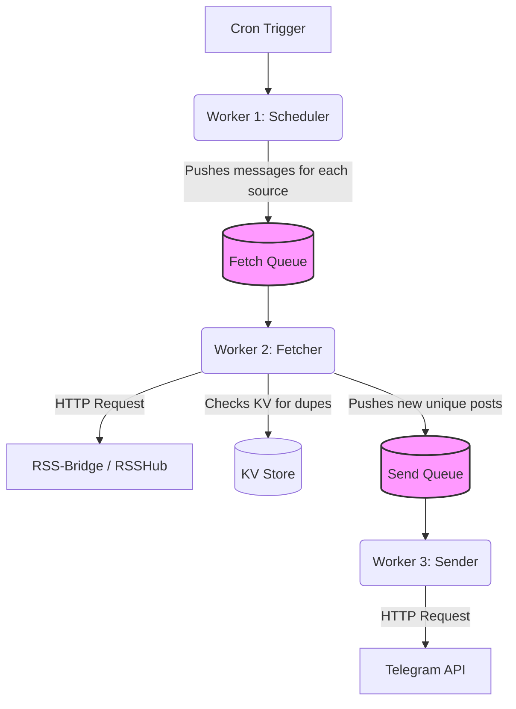

# Cloudflare Queues Integration for RSS-Bridge Telegram Bot

## Context & Problem
Currently, the bot executes via a single Cloudflare Worker. When the cron trigger fires (`checkAllFeeds`), it loops through all registered channels, fetches the RSS feeds via HTTP from public instances, and then sends new posts via HTTP to the Telegram API. 

**Problems on the Free Tier:**
1. **CPU Time Limit:** Cloudflare Workers (Free) have a strict 10ms CPU time limit per request, and 30s per cron execution. As more channels are added, the single cron worker will inevitably time out and fail to process everything.
2. **I/O Bottlenecks:** Both fetching the RSS feeds (which often timeout or failover) and uploading rich media to Telegram (videos up to 50MB) are slow, blocking operations.
3. **Lack of Retries:** If Telegram throws a temporary 429 Too Many Requests or a 502 Bad Gateway during a burst of new posts, the current worker throws an error and that post is lost forever unless manually re-tested.

## Proposed Solution: The Two-Tier Queue Architecture
We will implement Cloudflare Queues to completely decouple the scheduling, fetching, and sending phases. This leverages Cloudflare's free robust message brokering to guarantee delivery, automatically retry failures, and easily scale horizontally.

### Architecture Overview

### 1. The Fetch Queue (`feed-fetch-queue`)
* **Producer:** The primary Cron Trigger. Instead of actually fetching anything, it rapidly reads the list of active channels from KV and pushes a tiny message into this queue for every single source that needs checking.
* **Payload:** Minimal state. `{ channelId: string, sourceId: string }`
* **Consumer:** The Worker will consume these messages in parallel. It will load the specific source configuration from KV, run the RSS failover logic, identify *new* posts by checking the KV history, and then push those new posts to the next queue.

### 2. The Send Queue (`telegram-send-queue`)
* **Producer:** The Fetcher Worker (after identifying a new post).
* **Payload:** The exact data needed to format and dispatch the message. `{ channelId: string, item: FeedItem, formatSettings: FormatSettings }`
* **Consumer:** The Worker will consume these messages. It handles downloading the rich media (TikToks, Instagram Stories), formatting the caption, and dispatching it to the Telegram API.
* **Resilience:** If Telegram returns a 429, the consumer throws an error. Cloudflare Queues will automatically back off and retry this exact message again later. No posts are ever lost.

## Trade-offs & Considerations
* **Eventual Consistency:** Posts are no longer sent the literal millisecond the cron fires. There may be a few seconds of delay as messages traverse the queues. This is acceptable for an RSS bot.
* **KV Read Amplification:** Because the payloads are minimal, the consuming workers must re-read the channel configuration from KV. This will marginally increase KV read operations, but reads are cheap and fast on Cloudflare.
* **Complexity:** The codebase transitions from a simple linear script to an asynchronous, distributed event-driven system. Debugging requires checking queue dead-letter queues (DLQs) instead of just single worker logs.

## Next Steps
Does this two-tier Queue architecture sound like the right approach for your needs? If approved, I will formulate the specific code changes and `wrangler.toml` bindings required to implement it.