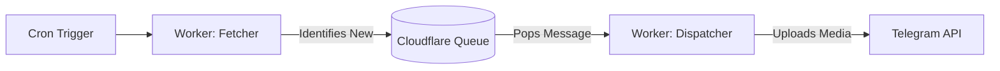

# Cloudflare Queues Dispatcher for RSS-Bridge Telegram Bot

## Context & Problem
Currently, the bot fetches and sends posts in a single synchronous execution. When a source (like an Instagram user) has many new posts, or when the Telegram API is slow/throttled, the Cloudflare Worker can hit its 10ms CPU or 30s wall-clock limit, causing the process to crash and posts to be lost. 

## Proposed Solution
Implement **Cloudflare Queues** to decouple the **Fetching** phase from the **Sending** phase.

### High-Level Design
1.  **Fetcher (Producer)**: The cron job or `/test` command fetches the RSS feed and identifies new posts. Instead of calling Telegram, it pushes a message into the Cloudflare Queue.
2.  **Sender (Consumer)**: A secondary Worker (or the same worker with a queue handler) pulls messages from the queue. It handles the media downloading, caption formatting, and the final Telegram API call.

### Queue Message Payload
The messages will be **full and self-contained** to ensure the sender has everything it needs without re-fetching:
```json
{
  "channelId": 1234567,
  "item": {
    "id": "post_123",
    "title": "Post Title",
    "link": "https://instagram.com/p/...",
    "media": [ ... ]
  },
  "formatSettings": {
    "hashtags": "enabled",
    "viewCount": "remove",
    "customFooter": "..."
  }
}
```

### Benefits
*   **Zero Post Loss**: If Telegram is down or returns a `429 Too Many Requests`, Cloudflare Queues will automatically retry the message with an exponential backoff.
*   **Performance**: The primary fetcher finishes almost instantly because it just "drops" messages into the queue.
*   **Scalability**: Handles "bursts" of content (e.g., 20 stories posted at once) without timing out the worker.

### Architecture Data Flow


## Next Steps
Does this design for the Queue-based dispatcher look correct? If approved, I will create the implementation plan including the `wrangler.toml` changes and the new `src/queue-handler.ts`.